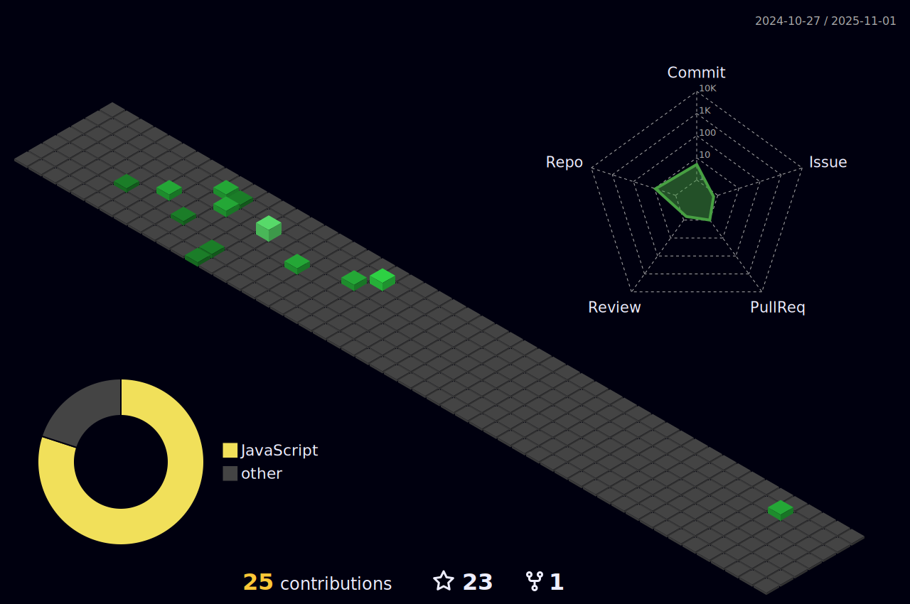

### Hi there 👋, My name is Shishir
#### Aspiring Full-stack Web Developer

I like solving puzzles and exploring new Places. Having conversation with computers is my Passion

Skills: PYTHON / JS / HTML / CSS

- 🔭 I’m currently working on Cloning web-pages as project 
- 🌱 I’m currently learning Java 
- 👯 I’m looking to collaborate on Javascript 
- 💬 Ask me about HTML/CSS, DSA 
- 😄 Pronouns: He/him/his 
- ⚡ Fun fact: You don't get to choose your happiness, as happiness is not a choice but a state of mind. 

        

 

  

  

  

  

  

